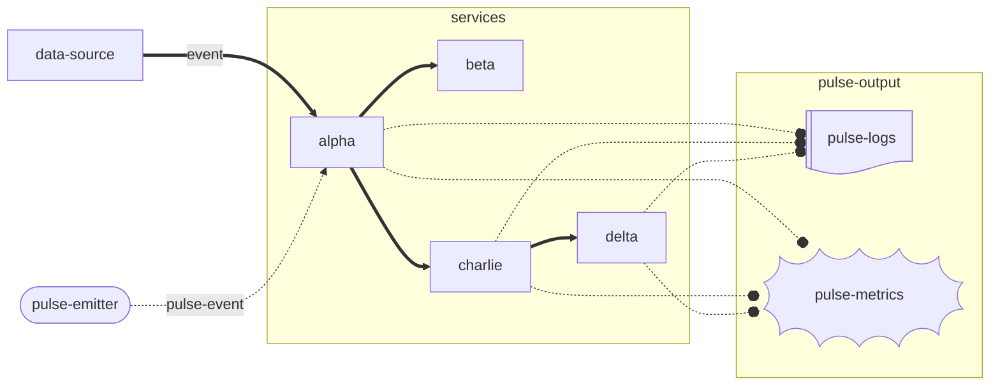

# Pulse Echo

Pulse Echoes represent regularly emitted special events (pulses) traveling through event-driven architectures, with their emitted metrics and logs as the "echoes" reflecting each pulse’s journey. Metrics and logs are only useful when emitted regularly; by tracking the presence of pulses, missing echoes become early warnings, enabling alerts when a system or microservice crashes or events go missing. They provide a powerful tool for in-production debugging, greenfield service development, live architecture documentation, and simple piece of mind that everything is operating as it should. Think of this as TDD for Event Driven Architecture.

